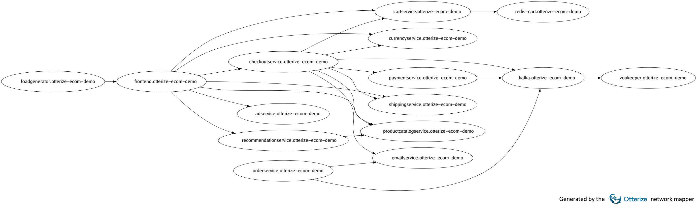
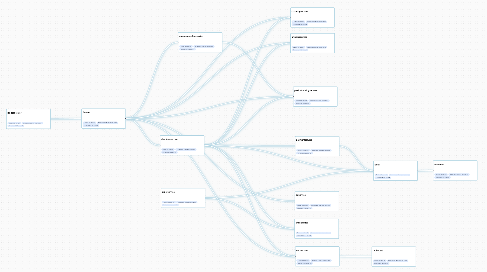

# Otterize network mapper


[](https://goreportcard.com/report/github.com/otterize/network-mapper/src)
[](https://joinslack.otterize.com)

Maps pod-to-pod traffic, pod-to-Internet traffic, and even AWS IAM traffic, with zero-config.

* [About](#about)
* [Try the network mapper](#try-the-network-mapper)
* [Installation instructions](#installation-instructions)
* How does the network mapper work?
  * [Components](#components)
  * [Service name resolution](#service-name-resolution)
* [Exporting a network map](#exporting-a-network-map)
* [Learn more](#learn-more)
* [Contributing](#contributing)
* [Slack](#slack)

<https://user-images.githubusercontent.com/20886410/205926414-a5fb6755-b5fa-45f3-9b15-d4f867547836.mp4>

## About

The Otterize network mapper is a zero-config tool that aims to be lightweight and doesn't require you to adapt anything in your cluster. Its goal is to give you insights about traffic in your cluster without a complete overhaul or the need to adapt anything to it, unlike other solutions, which may require deploying a new CNI, a service mesh, and so on.

You can use the [Otterize CLI](https://github.com/otterize/otterize-cli) to list the traffic by client, visualize the traffic, export the results as JSON or YAML, or reset the traffic the mapper remembers.

Example output after running `otterize network-mapper visualize` on the [Google Cloud microservices demo](https://github.com/GoogleCloudPlatform/microservices-demo):


The same microservices demo in the [Otterize Cloud](https://otterize.com/cloud-beta) access graph, as it appears when you choose to connect the network mapper to Otterize Cloud:


Example output after running `otterize network-mapper list` on the Google Cloud microservices demo:

```bash
cartservice in namespace otterize-ecom-demo calls:
  - redis-cart
checkoutservice in namespace otterize-ecom-demo calls:
  - cartservice
  - currencyservice
  - emailservice
  - paymentservice
  - productcatalogservice
  - shippingservice
frontend in namespace otterize-ecom-demo calls:
  - adservice
  - cartservice
  - checkoutservice
  - currencyservice
  - productcatalogservice
  - recommendationservice
  - shippingservice
loadgenerator in namespace otterize-ecom-demo calls:
  - frontend
recommendationservice in namespace otterize-ecom-demo calls:
  - productcatalogservice
```

## Try the network mapper

Try the [quickstart](https://docs.otterize.com/quick-tutorials/k8s-network-mapper) to get a hands-on experience in 5 minutes.

Looking to map AWS traffic? Check out the [AWS visibility tutorial](https://docs.otterize.com/features/aws-iam/tutorials/aws-visibility).

## Installation instructions

### Install and run the network mapper using Helm

```bash
helm repo add otterize https://helm.otterize.com
helm repo update
helm install network-mapper otterize/network-mapper -n otterize-system --create-namespace --wait
```

### Install Otterize CLI to query data from the network mapper

Mac

```bash
brew install otterize/otterize/otterize-cli
```

Linux 64-bit

```bash
wget https://get.otterize.com/otterize-cli/v1.0.9/otterize_linux_x86_64.tar.gz
tar xf otterize_linux_x86_64.tar.gz
sudo cp otterize /usr/local/bin
```

Windows

```bash
scoop bucket add otterize-cli https://github.com/otterize/scoop-otterize-cli
scoop update
scoop install otterize-cli
```

For more platforms, see [the installation guide](https://docs.otterize.com/installation#install-the-otterize-cli).

### Components

* Mapper - the mapper is deployed once per cluster, and receives traffic information from the sniffer and watchers, and resolves the information to communications between [service identities](https://docs.otterize.com/reference/service-identities).
* Sniffer - the sniffer is deployed to each node using a DaemonSet, and is responsible for capturing node-local DNS traffic and inspecting open connections.
* Kafka watcher - the Kafka watcher is deployed once per cluster and is responsible for detecting accesses to Kafka topics, which services perform those accesses and which operations they use.
* Istio watcher - the Istio watcher is part of the Mapper and queries Istio Envoy sidecars for HTTP traffic statistics, which are used to detect HTTP traffic with paths. Currently, the Istio watcher has a limitation where it reports all HTTP traffic seen by the sidecar since it was started, regardless of when it was seen.
* AWS IAM visibility - The AWS IAM visibility components are optionally deployed with `--set aws.visibility.enabled=true`. Label pods with `network-mapper.otterize.com/aws-visibility: true`, and if connected to Otterize Cloud, the Cloud will combine the information to put together a map of accesses to AWS resources, which you can export as ClientIntents yamls for use with the [Intents Operator](https://github.com/otterize/intents-operator).

### DNS responses

DNS is a common network protocol used for service discovery. When a pod (`checkoutservice`) tries to connect to a Kubernetes service
(`orderservice`) or another pod, a DNS query is sent out. The network mapper watches DNS responses and extracts the IP addresses, which are used for the [service identity resolving process](https://docs.otterize.com/reference/service-identities).

### Active TCP connections

DNS responses will only appear when new connections are opened. To handle long-lived connections, the network mapper also queries open TCP connections in a manner similar to `netstat` or `ss`. The IP addresses are used for the [service identity resolving process](https://docs.otterize.com/reference/service-identities), as above.

### Kafka logs

The Kafka watcher periodically examines logs of Kafka servers provided by the user through configuration, parses them and deduces topic-level access to Kafka from pods in the cluster.
The watcher is only able to parse Kafka logs when Kafka servers' Authorizer logger is configured to output logs to `stdout` with `DEBUG` level.

### Istio sidecar metrics

The Istio watcher, part of the Network mapper periodically queries for all pods with the `security.istio.io/tlsMode` label, queries each pod's Istio sidecar for metrics about connections, and deduces connections with HTTP paths between pods covered by the Istio service mesh.

### AWS IAM visibility

AWS IAM visibility consists of several components: a HTTP proxy that proxies AWS traffic for pods which you opt-in on using the label `network-mapper.otterize.com/aws-visibility: true`, a webhook admission controller that patches Pods with that label as they are admitted to add a certificate for the HTTP proxy and direct DNS traffic for amazonaws.com to a DNS server belonging to the network mapper, and finally said DNS server which responds only to amazonaws.com requests and forwards the rest to the cluster's DNS server.

### Service name resolution

Service names are resolved in one of two ways:

1. If an `otterize/service-name` label is present, that name is used.
2. If not, a recursive look-up is performed for the Kubernetes resource owner for a pod until the root is reached.
For example, if you have a `Deployment` named `client`, which then creates and owns a `ReplicaSet`,
which then creates and owns a `Pod`, then the service name for that pod is `client` - same as the name of the `Deployment`.
The goal is to generate a mapping that speaks in the same language that dev teams use.

## Exporting a network map

The network mapper continuously builds a map of pod to pod communication in the cluster. The map can be exported at any time in either JSON or YAML formats with the Otterize CLI.

The YAML export is formatted as `ClientIntents` Kubernetes resource files. Client intents files can be consumed by the [Otterize intents operator](https://github.com/otterize/intents-operator) to configure pod-to-pod access with network policies, or Kafka client access with Kafka ACLs and mTLS.

## Learn more

Explore our [documentation](https://docs.otterize.com/) site to learn how to:

* [Map pod-to-pod communication](https://docs.otterize.com/quick-tutorials/k8s-network-mapper).
* [Automate network policies](https://docs.otterize.com/quick-tutorials/k8s-network-policies).
* And more...

## Contributing

1. Feel free to fork and open a pull request! Include tests and document your code in [Godoc style](https://go.dev/blog/godoc)
2. In your pull request, please refer to an existing issue or open a new one.
3. See our [Contributor License Agreement](https://github.com/otterize/cla/).

## Slack

To join the conversation, ask questions, and engage with other users, join the Otterize Slack!

[](https://joinslack.otterize.com)

## Usage telemetry

The mapper reports anonymous usage information back to the Otterize team, to help the team understand how the software is used in the community and what aspects users find useful. No personal or organizational identifying information is transmitted in these metrics: they only reflect patterns of usage. You may opt out at any time through a single configuration flag.

To **disable** sending usage information:

* Via the Otterize OSS Helm chart: `--set global.telemetry.enabled=false`.
* Via an environment variable: `OTTERIZE_TELEMETRY_ENABLED=false`.
* If running a mapper directly: `--telemetry-enabled=false`.

If the `telemetry` flag is omitted or set to `true`, telemetry will be enabled: usage information will be reported.

Read more about it in the [Usage telemetry Documentation](https://docs.otterize.com/otterize-oss/usage-telemetry)
