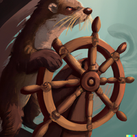

# Otterize network mapper




[](https://goreportcard.com/report/github.com/otterize/network-mapper/src)
[](https://joinslack.otterize.com)

[About](#about) | [Quick tutorial](https://docs.otterize.com/quick-tutorials/k8s-network-mapper) | [Installation instructions](#installation-instructions) | [How does the network mapper work?](#how-does-the-network-mapper-work) | [Docs](https://docs.otterize.com/components/network-mapper/) | [Contributing](#contributing) | [Slack](#slack)

[](./mapper.mp4)

## About
The Otterize network mapper creates a map of in-cluster traffic by capturing DNS traffic and inspecting active connections then resolving the IP addresses participating in connections to the pods, and crawling up the ownership of the pod until it reaches the root object. See [Service name resolution](#service-name-resolution) to learn more. The network mapper continues building the network map as long as it's deployed.

You can then use the [Otterize CLI](https://github.com/otterize/otterize-cli) to list the traffic by client, reset the traffic the mapper remembers, or export it as JSON or YAML.

Example output from running the network mapper on the [Google Cloud microservices demo](https://github.com/GoogleCloudPlatform/microservices-demo):
```bash
$ otterize mapper list
cartservice in namespace ecommerce calls:
  - redis-cart
checkoutservice in namespace ecommerce calls:
  - kafka-secure
frontend in namespace ecommerce calls:
  - adservice
  - cartservice
  - checkoutservice
  - currencyservice
  - productcatalogservice
  - recommendationservice
  - shippingservice
kafka-secure in namespace ecommerce calls:
  - kafka-secure
  - lab-zookeeper
paymentservice in namespace ecommerce calls:
  - kafka-secure
recommendationservice in namespace ecommerce calls:
  - productcatalogservice
```

## Installation instructions
### Install the network mapper using Helm
```bash
helm repo add otterize https://helm.otterize.com
helm repo update
helm install network-mapper otterize/network-mapper -n otterize-system --create-namespace --wait
```
### Install Otterize CLI to query data from the network mapper
Mac
```bash
brew install otterize/otterize/otterize-cli
```
Linux 64-bit
```bash
wget https://get.otterize.com/otterize-cli/v0.1.5/otterize_Linux_x86_64.tar.gz
tar xf otterize_Linux_x86_64.tar.gz
sudo cp otterize /usr/local/bin
```
Windows
```bash
scoop bucket add otterize-cli https://github.com/otterize/scoop-otterize-cli
scoop update
scoop install otterize-cli
```
For more platforms, see [the installation guide](https://docs.otterize.com/k8s-installation/#install-the-otterize-cli).

## How does the network mapper work?

### Components
- Sniffer - the sniffer is deployed to each node, and is responsible for capturing node-local DNS traffic and inspecting open connections.
- Mapper - the mapper is deployed once, and resolves service names using the Kubernetes API with traffic information reported by the sniffers.

### Service name resolution
Service name resolution is performed one of two ways:
1. If an `otterize/service-name` label exists on the pod, its value is used.
2. If no label is present, a recursive look up is performed for the pod's owner until the root is reached. For example, if you have a `Deployment` named `client`, which then creates and owns a `ReplicaSet`, which then creates and owns a `Pod`, then the service name for that pod is `client` - same as the name of the `Deployment`.

The goal is to generate a mapping that speaks in the same language that dev teams use.

## Learn more
Explore our [documentation](https://docs.otterize.com/) site to learn how to:
- [Map pod-to-pod communication](https://docs.otterize.com/guides/k8s-mapping-pod-to-pod-calls).
- [Automate network policies](https://docs.otterize.com/quick-tutorials/k8s-network-policies).
- And more ...

## Contributing
1. Feel free to fork and open a pull request! Include tests and document your code in [Godoc style](https://go.dev/blog/godoc)
2. In your pull request, please refer to an existing issue or open a new one.
3. See our [Contributor License Agreement](https://github.com/otterize/cla/).

## Slack
[](https://joinslack.otterize.com)